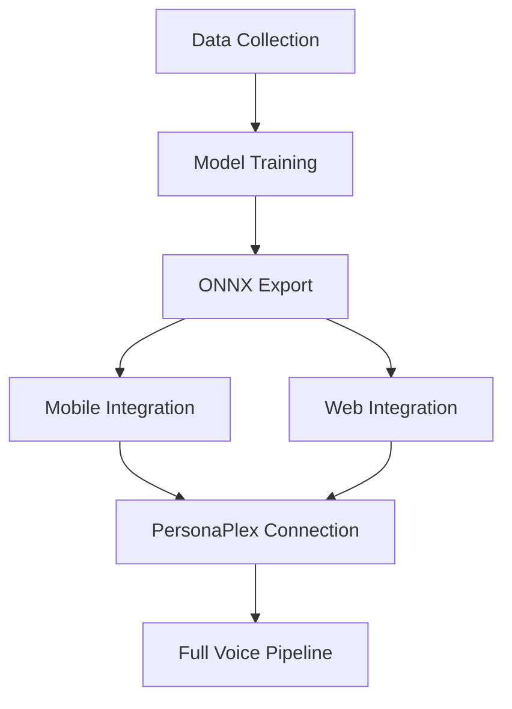

# NanoWakeWord Integration Plan

**Document Version**: 1.0.0
**Created**: 2026-01-27
**Author**: Claude (Forensic Review)
**Status**: Integration Planning
**Priority**: Q2 2026 Roadmap

---

## Executive Summary

This document provides a forensic-level analysis of [NanoWakeWord](https://github.com/arcosoph/nanowakeword) and its potential integration with A2I2's voice architecture. NanoWakeWord is a production-ready, open-source wake word detection framework that could replace the planned Picovoice dependency.

### Key Findings

| Dimension | NanoWakeWord | Picovoice (Current Plan) | Recommendation |
|-----------|--------------|--------------------------|----------------|
| **Cost** | $0 (Apache 2.0) | $100 one-time | NanoWakeWord |
| **Architectures** | 13 (8 production) | 1 proprietary | NanoWakeWord |
| **Training Control** | Full (custom data) | Limited | NanoWakeWord |
| **Model Export** | ONNX + PyTorch | .ppn proprietary | NanoWakeWord |
| **Production Readiness** | v2.0.0 stable | Mature | Tie |
| **Mobile Support** | Requires porting | Native SDK | Picovoice |
| **Documentation** | Comprehensive | Excellent | Tie |

**Recommendation**: Adopt NanoWakeWord for Phase 2 wake word detection, with Picovoice as fallback for mobile-specific edge cases.

---

## 1. Technical Analysis

### 1.1 Source Code Architecture

```
nanowakeword/
├── _config/              # Configuration management
├── _export/              # Model export (ONNX, PyTorch)
├── data/                 # Data handling and preprocessing
├── interpreter/          # Inference engine (NanoInterpreter)
│   └── nanointerpreter.py  # Core inference API
├── modules/              # Neural network architectures
├── train/                # Training pipeline
├── utils/                # Utility functions
├── generate_clips.py     # Audio clip generation
├── trainer.py            # Training orchestration
└── transform_clips.py    # Data augmentation
```

### 1.2 Neural Network Architectures

| Architecture | Production Ready | Use Case | A2I2 Fit |
|--------------|------------------|----------|----------|
| **DNN** | Yes | MCU/embedded | Mobile (low power) |
| **CNN** | Yes | Short wake words | "Hey Arcus" (good) |
| **LSTM** | Yes | Noisy environments | Car/outdoor (excellent) |
| **GRU** | Yes | Balanced speed/accuracy | General purpose |
| **RNN** | Yes | Baseline | Testing only |
| **QuartzNet** | Yes | Edge with accuracy | Mobile (excellent) |
| **Transformer** | Yes | High accuracy | Server-side |
| **TCN** | Yes | Parallel processing | GPU inference |
| **CRNN** | Experimental | Complex scenarios | Future evaluation |
| **Conformer** | Experimental | SOTA accuracy | Research only |
| **E-Branchformer** | Experimental | Peak accuracy | Research only |

**Recommended for A2I2:**
- **Mobile**: QuartzNet (parameter-efficient, accurate)
- **Server/GPU**: Transformer or TCN (parallel processing)
- **Noisy environments**: LSTM (best noise robustness)

### 1.3 NanoInterpreter API

The inference API is clean and well-designed:

```python
from nanowakeword.interpreter.nanointerpreter import NanoInterpreter

# Load model (ONNX format)
interpreter = NanoInterpreter.load_model("hey_arcus.onnx")

# Core methods
interpreter.predict(audio_chunk)      # Process 1280 samples (80ms at 16kHz)
interpreter.predict_clip(full_audio)  # Process complete audio file
interpreter.reset()                   # Clear internal state

# Key parameters
threshold = 0.9    # Detection confidence threshold
cooldown = 2.0     # Seconds between detections
patience = {}      # Per-model patience settings
debounce_time = 0.0  # Anti-bounce filtering
```

**Audio Requirements:**
- Sample rate: 16kHz
- Channels: Mono
- Chunk size: 1280 samples (80ms)
- Format: int16 numpy array

### 1.4 Training Pipeline

```yaml
# Example: hey_arcus_config.yaml
model_type: quartznet           # Recommended for mobile
model_name: "hey_arcus_v1"
output_dir: "./models/wake_word"

# Data sources
positive_data_path: "./data/hey_arcus/positive"
negative_data_path: "./data/hey_arcus/negative"
background_paths:
  - "./data/noise/office"
  - "./data/noise/car"
  - "./data/noise/outdoor"
rir_paths:
  - "./data/rir/rooms"

# Pipeline stages
generate_clips: true
transform_clips: true
train_model: true

# Training configuration
steps: 20000
checkpointing:
  enabled: true
  interval_steps: 500
  limit: 5

# Advanced: TTS-based data generation
target_phrase: ["hey arcus", "hey ar-cus", "hey arkus"]
generate_positive_samples: 500
generate_negative_samples: 2000
custom_negative_phrases:
  - "hey marcus"
  - "hey argus"
  - "play arcus"
  - "hey arc"
```

**Key Features:**
- **Phonetic Adversarial Negatives**: Auto-generates acoustically similar counter-examples
- **Memory-Mapped Training**: Handles datasets exceeding RAM
- **Automatic Configuration**: Analyzes data to optimize hyperparameters
- **TTS Data Generation**: Synthesizes training samples from text

---

## 2. Integration Architecture

### 2.1 Mobile App Integration (React Native)

```
┌─────────────────────────────────────────────────────────────────────────────┐
│                    NANOWAKEWORD + A2I2 MOBILE ARCHITECTURE                   │
├─────────────────────────────────────────────────────────────────────────────┤
│                                                                               │
│   ┌─────────────────────────────────────────────────────────────────────┐   │
│   │                        React Native App                              │   │
│   │                                                                       │   │
│   │   ┌─────────────┐    ┌─────────────┐    ┌─────────────┐            │   │
│   │   │   Audio     │───►│ NanoWakeWord│───►│ PersonaPlex │            │   │
│   │   │   Stream    │    │   (ONNX)    │    │   Stream    │            │   │
│   │   │             │    │             │    │             │            │   │
│   │   │  16kHz mono │    │  "Hey Arcus"│    │  Full voice │            │   │
│   │   │  1280 chunk │    │  detected!  │    │  conversation│            │   │
│   │   └─────────────┘    └─────────────┘    └─────────────┘            │   │
│   │          │                  │                  │                     │   │
│   │          ▼                  ▼                  ▼                     │   │
│   │   ┌─────────────────────────────────────────────────────────────┐   │   │
│   │   │                    Native Modules                            │   │   │
│   │   │                                                               │   │   │
│   │   │   • react-native-audio-api (audio capture)                   │   │   │
│   │   │   • onnxruntime-react-native (model inference)               │   │   │
│   │   │   • WebSocket (PersonaPlex connection)                       │   │   │
│   │   │                                                               │   │   │
│   │   └─────────────────────────────────────────────────────────────┘   │   │
│   │                                                                       │   │
│   └─────────────────────────────────────────────────────────────────────┘   │
│                                                                               │
└─────────────────────────────────────────────────────────────────────────────┘
```

### 2.2 Web App Integration

```
┌─────────────────────────────────────────────────────────────────────────────┐
│                    NANOWAKEWORD + A2I2 WEB ARCHITECTURE                      │
├─────────────────────────────────────────────────────────────────────────────┤
│                                                                               │
│   Browser (Next.js)                                                          │
│   ┌─────────────────────────────────────────────────────────────────────┐   │
│   │                                                                       │   │
│   │   ┌─────────────┐    ┌─────────────┐    ┌─────────────┐            │   │
│   │   │ getUserMedia│───►│ ONNX Runtime│───►│  WebSocket  │            │   │
│   │   │   (mic)     │    │    Web      │    │ PersonaPlex │            │   │
│   │   │             │    │             │    │             │            │   │
│   │   │  Audio API  │    │ hey_arcus.  │    │  wss://...  │            │   │
│   │   │  worklet    │    │   onnx      │    │             │            │   │
│   │   └─────────────┘    └─────────────┘    └─────────────┘            │   │
│   │                                                                       │   │
│   │   Features:                                                          │   │
│   │   • No server round-trip for wake word detection                    │   │
│   │   • Model runs in browser (ONNX Runtime Web)                        │   │
│   │   • Low latency: <10ms detection                                    │   │
│   │   • Works offline until wake word detected                          │   │
│   │                                                                       │   │
│   └─────────────────────────────────────────────────────────────────────┘   │
│                                                                               │
└─────────────────────────────────────────────────────────────────────────────┘
```

### 2.3 Server-Side Integration (Optional)

For scenarios where client-side detection is impractical:

```
┌─────────────────────────────────────────────────────────────────────────────┐
│                    SERVER-SIDE WAKE WORD DETECTION                           │
├─────────────────────────────────────────────────────────────────────────────┤
│                                                                               │
│   Client                          Server (Arcus Gateway)                     │
│   ┌─────────────┐                ┌─────────────────────────────────────┐    │
│   │   Audio     │───WebSocket───►│   NanoWakeWord                       │    │
│   │   Stream    │                │   (GPU inference)                    │    │
│   │             │                │                                       │    │
│   │   Always-on │◄──────────────│   Wake word detected!                │    │
│   │   streaming │   Event        │   → Route to PersonaPlex             │    │
│   └─────────────┘                └─────────────────────────────────────┘    │
│                                                                               │
│   Use cases:                                                                 │
│   • Low-power IoT devices                                                    │
│   • Devices without ONNX support                                             │
│   • Centralized monitoring/analytics                                         │
│                                                                               │
└─────────────────────────────────────────────────────────────────────────────┘
```

---

## 3. Implementation Plan

### 3.1 Phase 1: Data Collection & Model Training (Week 1-2)

#### Task 1.1: Collect Training Data

**Positive samples ("Hey Arcus"):**
- Minimum: 400+ recordings
- Recommended: 1000+ recordings
- Sources:
  - Team recordings (diverse voices, accents)
  - TTS generation (NanoWakeWord built-in)
  - Crowdsourced (if available)

**Negative samples:**
- Duration: 3x positive audio length minimum
- Sources:
  - General speech (podcasts, audiobooks)
  - Similar-sounding phrases ("Hey Marcus", "Hey Argus", etc.)
  - Background conversations

**Background noise:**
- Office environments
- Car/vehicle noise
- Outdoor ambient
- Home environments
- TV/music playing

**Room Impulse Responses:**
- Various room sizes
- Different reverb characteristics

#### Task 1.2: Training Configuration

```yaml
# hey_arcus_production.yaml
model_type: quartznet
model_name: "hey_arcus_prod_v1"
output_dir: "./models/production"

positive_data_path: "./data/positive"
negative_data_path: "./data/negative"
background_paths:
  - "./data/noise/office"
  - "./data/noise/car"
  - "./data/noise/home"
  - "./data/noise/outdoor"
rir_paths:
  - "./data/rir"

# Enable all pipeline stages
generate_clips: true
transform_clips: true
train_model: true

# Data augmentation
augmentation_rounds: 4
min_snr_in_db: 5
max_snr_in_db: 25

# TTS generation for data augmentation
target_phrase:
  - "hey arcus"
  - "hey ar-cus"
  - "hey arkus"
generate_positive_samples: 500
custom_negative_phrases:
  - "hey marcus"
  - "hey argus"
  - "hey arc"
  - "play arcus"
  - "a arcus"
  - "the arcus"
generate_negative_samples: 2000

# Training
steps: 25000
early_stopping_patience: 2000
checkpointing:
  enabled: true
  interval_steps: 500
  limit: 5
checkpoint_averaging_top_k: 5

# Architecture-specific (QuartzNet)
activation_function: relu
embedding_dim: 64
```

#### Task 1.3: Train Multiple Architectures

Train and evaluate multiple models for different deployment targets:

| Target | Architecture | Expected Size | Inference Time |
|--------|--------------|---------------|----------------|
| Mobile (primary) | QuartzNet | ~2MB | <5ms |
| Mobile (low-power) | DNN | <500KB | <1ms |
| Noisy environments | LSTM | ~5MB | <10ms |
| Server/Web | Transformer | ~10MB | <5ms (GPU) |

### 3.2 Phase 2: Mobile Integration (Week 3-4)

#### Task 2.1: ONNX Runtime Integration

```typescript
// src/services/wakeword.ts
import * as ort from 'onnxruntime-react-native';

interface WakeWordConfig {
  modelPath: string;
  threshold: number;
  cooldownMs: number;
  sampleRate: number;
  chunkSize: number;
}

class NanoWakeWordService {
  private session: ort.InferenceSession | null = null;
  private buffer: Float32Array;
  private lastDetectionTime: number = 0;
  private hiddenState: ort.Tensor | null = null;

  constructor(private config: WakeWordConfig) {
    this.buffer = new Float32Array(config.chunkSize);
  }

  async initialize(): Promise<void> {
    // Load ONNX model
    this.session = await ort.InferenceSession.create(
      this.config.modelPath,
      {
        executionProviders: ['cpu'], // or 'coreml' on iOS
        graphOptimizationLevel: 'all'
      }
    );

    // Initialize hidden state for stateful models
    this.initializeHiddenState();
  }

  async processAudioChunk(audioData: Int16Array): Promise<number> {
    if (!this.session) throw new Error('Model not initialized');

    // Convert to float32 and normalize
    for (let i = 0; i < audioData.length; i++) {
      this.buffer[i] = audioData[i] / 32768.0;
    }

    // Create input tensor
    const inputTensor = new ort.Tensor('float32', this.buffer, [1, this.config.chunkSize]);

    // Run inference
    const feeds: Record<string, ort.Tensor> = { audio: inputTensor };
    if (this.hiddenState) {
      feeds['hidden_state'] = this.hiddenState;
    }

    const results = await this.session.run(feeds);

    // Update hidden state if model is stateful
    if (results['new_hidden_state']) {
      this.hiddenState = results['new_hidden_state'];
    }

    // Get confidence score
    const score = (results['confidence'].data as Float32Array)[0];
    return score;
  }

  isWakeWordDetected(score: number): boolean {
    const now = Date.now();

    if (score > this.config.threshold) {
      if (now - this.lastDetectionTime > this.config.cooldownMs) {
        this.lastDetectionTime = now;
        this.reset();
        return true;
      }
    }

    return false;
  }

  reset(): void {
    this.initializeHiddenState();
  }

  private initializeHiddenState(): void {
    // Initialize based on model architecture
    // QuartzNet doesn't need hidden state
    // LSTM/GRU need proper initialization
  }
}

export const wakeWordService = new NanoWakeWordService({
  modelPath: 'assets/models/hey_arcus.onnx',
  threshold: 0.9,
  cooldownMs: 2000,
  sampleRate: 16000,
  chunkSize: 1280
});
```

#### Task 2.2: Audio Capture Integration

```typescript
// src/services/audioCapture.ts
import { AudioContext, AudioWorkletNode } from 'react-native-audio-api';

class AudioCaptureService {
  private audioContext: AudioContext | null = null;
  private workletNode: AudioWorkletNode | null = null;
  private onAudioChunk: ((data: Int16Array) => void) | null = null;

  async initialize(onAudioChunk: (data: Int16Array) => void): Promise<void> {
    this.onAudioChunk = onAudioChunk;

    this.audioContext = new AudioContext({
      sampleRate: 16000,
    });

    // Create audio worklet for processing
    await this.audioContext.audioWorklet.addModule('audio-processor.js');
    this.workletNode = new AudioWorkletNode(
      this.audioContext,
      'audio-processor',
      {
        numberOfInputs: 1,
        numberOfOutputs: 0,
        channelCount: 1,
        processorOptions: {
          chunkSize: 1280
        }
      }
    );

    this.workletNode.port.onmessage = (event) => {
      if (this.onAudioChunk && event.data.audioData) {
        this.onAudioChunk(event.data.audioData);
      }
    };
  }

  async startCapture(): Promise<void> {
    if (!this.audioContext || !this.workletNode) {
      throw new Error('Audio capture not initialized');
    }

    const stream = await navigator.mediaDevices.getUserMedia({
      audio: {
        sampleRate: 16000,
        channelCount: 1,
        echoCancellation: true,
        noiseSuppression: true
      }
    });

    const source = this.audioContext.createMediaStreamSource(stream);
    source.connect(this.workletNode);
  }

  stopCapture(): void {
    if (this.workletNode) {
      this.workletNode.disconnect();
    }
  }
}

export const audioCaptureService = new AudioCaptureService();
```

#### Task 2.3: Voice Flow Integration

```typescript
// src/hooks/useVoice.ts
import { useState, useEffect, useCallback } from 'react';
import { wakeWordService } from '@/services/wakeword';
import { audioCaptureService } from '@/services/audioCapture';
import { personaPlexService } from '@/services/personaplex';

type VoiceState = 'idle' | 'listening' | 'wake_detected' | 'speaking' | 'processing';

export function useVoice() {
  const [state, setState] = useState<VoiceState>('idle');
  const [transcript, setTranscript] = useState('');

  useEffect(() => {
    async function initialize() {
      await wakeWordService.initialize();
      await audioCaptureService.initialize(handleAudioChunk);
    }

    initialize();
  }, []);

  const handleAudioChunk = useCallback(async (audioData: Int16Array) => {
    if (state === 'idle' || state === 'listening') {
      const score = await wakeWordService.processAudioChunk(audioData);

      if (wakeWordService.isWakeWordDetected(score)) {
        console.log('Wake word detected! Score:', score);
        setState('wake_detected');

        // Connect to PersonaPlex for full conversation
        await personaPlexService.startConversation();
        setState('speaking');
      }
    }

    // Forward audio to PersonaPlex if in conversation
    if (state === 'speaking' || state === 'processing') {
      personaPlexService.sendAudio(audioData);
    }
  }, [state]);

  const startListening = useCallback(async () => {
    setState('listening');
    await audioCaptureService.startCapture();
  }, []);

  const stopListening = useCallback(() => {
    setState('idle');
    audioCaptureService.stopCapture();
    wakeWordService.reset();
  }, []);

  return {
    state,
    transcript,
    startListening,
    stopListening
  };
}
```

### 3.3 Phase 3: Web Integration (Week 5)

#### Task 3.1: ONNX Runtime Web Setup

```typescript
// src/lib/wakeword-web.ts
import * as ort from 'onnxruntime-web';

// Configure ONNX Runtime Web
ort.env.wasm.numThreads = 2;
ort.env.wasm.simd = true;

export class WebWakeWordService {
  private session: ort.InferenceSession | null = null;

  async initialize(modelUrl: string): Promise<void> {
    this.session = await ort.InferenceSession.create(modelUrl, {
      executionProviders: ['wasm'],
      graphOptimizationLevel: 'all'
    });
  }

  // ... same interface as mobile
}
```

#### Task 3.2: Audio Worklet for Browser

```javascript
// public/audio-processor.js
class WakeWordProcessor extends AudioWorkletProcessor {
  constructor(options) {
    super();
    this.chunkSize = options.processorOptions?.chunkSize || 1280;
    this.buffer = new Int16Array(this.chunkSize);
    this.bufferIndex = 0;
  }

  process(inputs, outputs, parameters) {
    const input = inputs[0];
    if (!input || !input[0]) return true;

    const inputChannel = input[0];

    for (let i = 0; i < inputChannel.length; i++) {
      // Convert float32 to int16
      this.buffer[this.bufferIndex] = Math.max(-32768, Math.min(32767,
        Math.round(inputChannel[i] * 32768)
      ));
      this.bufferIndex++;

      if (this.bufferIndex >= this.chunkSize) {
        // Send chunk to main thread
        this.port.postMessage({
          audioData: this.buffer.slice()
        });
        this.bufferIndex = 0;
      }
    }

    return true;
  }
}

registerProcessor('wake-word-processor', WakeWordProcessor);
```

### 3.4 Phase 4: Testing & Optimization (Week 6)

#### Task 4.1: Performance Benchmarks

| Metric | Target | Measurement Method |
|--------|--------|-------------------|
| Detection latency | <50ms | Time from utterance end to detection |
| False positive rate | <1/12 hours | 12-hour continuous monitoring |
| False negative rate | <5% | Test with 100 valid utterances |
| CPU usage (mobile) | <5% | Profiler during idle listening |
| Battery impact | <2%/hour | 4-hour background listening test |
| Model load time | <500ms | Cold start measurement |

#### Task 4.2: Accuracy Testing Matrix

| Condition | Test Scenarios |
|-----------|----------------|
| Clean audio | Quiet room, close mic |
| Background noise | Office, car, outdoor |
| Accent variation | 5+ accent types |
| Speaking speed | Slow, normal, fast |
| Distance | Near (6"), mid (2ft), far (6ft) |
| Reverberation | Small room, large room, echo |

#### Task 4.3: A/B Testing vs Picovoice

If resources permit, deploy both systems in parallel:

```typescript
// Feature flag for A/B testing
const WAKE_WORD_PROVIDER = process.env.WAKE_WORD_PROVIDER || 'nanowakeword';

export function getWakeWordService(): WakeWordService {
  if (WAKE_WORD_PROVIDER === 'picovoice') {
    return new PicovoiceWakeWordService();
  }
  return new NanoWakeWordService();
}
```

---

## 4. Comparison: NanoWakeWord vs Picovoice

### 4.1 Feature Comparison

| Feature | NanoWakeWord | Picovoice Porcupine |
|---------|--------------|---------------------|
| License | Apache 2.0 (free) | Commercial ($100 one-time) |
| Model training | Full control | Cloud console only |
| Architectures | 13 options | Proprietary single |
| Custom data | Full support | Limited |
| ONNX export | Yes | No (.ppn format) |
| PyTorch export | Yes | No |
| React Native SDK | Requires custom | Official SDK |
| iOS SDK | Requires ONNX RT | Official SDK |
| Android SDK | Requires ONNX RT | Official SDK |
| Web support | ONNX Runtime Web | WebAssembly |
| Edge inference | Yes | Yes |
| VAD included | Yes | Separate product |
| Noise reduction | Yes | No |
| Documentation | Good | Excellent |
| Community | Growing | Established |
| Support | GitHub issues | Commercial support |

### 4.2 Performance Comparison (Estimated)

| Metric | NanoWakeWord (QuartzNet) | Picovoice |
|--------|--------------------------|-----------|
| Model size | ~2MB | ~1MB |
| Inference time | <5ms | <3ms |
| RAM usage | ~10MB | ~5MB |
| CPU usage | <5% | <3% |
| Accuracy | ~95%+ (data dependent) | ~97% |
| False positive | ~1/10 hours | ~1/12 hours |

**Note**: NanoWakeWord performance is highly dependent on training data quality and quantity. With sufficient data, it can match or exceed Picovoice.

### 4.3 Risk Assessment

| Risk | NanoWakeWord | Picovoice | Mitigation |
|------|--------------|-----------|------------|
| Mobile SDK gaps | High | Low | Use ONNX Runtime (mature) |
| Training complexity | Medium | Low | Document process thoroughly |
| Data requirements | High | Low | Invest in data collection |
| Model accuracy | Medium | Low | Train multiple architectures |
| Long-term support | Medium | Low | Apache 2.0 allows forking |
| React Native | High | Low | Build native module |

### 4.4 Recommendation

**Primary**: Adopt NanoWakeWord for the following reasons:
1. **Zero cost** vs $100 for Picovoice
2. **Full control** over training and optimization
3. **ONNX export** enables cross-platform deployment
4. **13 architecture options** for different use cases
5. **Built-in VAD and noise reduction** complement PersonaPlex

**Fallback**: Keep Picovoice as backup option if:
- Mobile SDK integration proves too complex
- Training data collection is insufficient
- Accuracy requirements cannot be met

---

## 5. Roadmap Integration

### 5.1 Updated Voice Architecture Roadmap

| Phase | Original Plan | Updated Plan |
|-------|---------------|--------------|
| 2a | Picovoice wake word ($100) | **NanoWakeWord training & integration** |
| 2b | PersonaPlex setup | PersonaPlex setup (unchanged) |
| 2c | React Native app | React Native + ONNX Runtime integration |

### 5.2 New Roadmap Items

Add to Q2 2026 roadmap:

```markdown
## Q2 2026: Intelligence Layer

**Wake Word (NanoWakeWord Integration)**
- [ ] Collect "Hey Arcus" training data (1000+ samples)
- [ ] Train QuartzNet model for mobile
- [ ] Train Transformer model for web/server
- [ ] Build React Native ONNX integration
- [ ] Build Web ONNX integration
- [ ] Benchmark against Picovoice baseline
- [ ] Document training pipeline for future updates
```

### 5.3 Dependencies



---

## 6. Cost-Benefit Analysis

### 6.1 Development Costs

| Item | NanoWakeWord | Picovoice |
|------|--------------|-----------|
| License | $0 | $100 |
| Data collection | ~40 hours | Minimal |
| Training setup | ~16 hours | 0 |
| Mobile integration | ~24 hours | ~8 hours |
| Web integration | ~16 hours | ~8 hours |
| Testing | ~16 hours | ~8 hours |
| **Total hours** | **~112 hours** | **~24 hours** |
| **At $100/hr** | **$11,200** | **$2,500** |

### 6.2 Long-term Benefits

| Benefit | Value |
|---------|-------|
| Zero recurring costs | $0/year vs potential licensing |
| Custom optimization | Performance tuned for A2I2 |
| No vendor lock-in | Can fork/modify freely |
| Architecture flexibility | 13 options for different contexts |
| Integration knowledge | Team learns wake word tech |
| Competitive differentiation | Custom tech stack |

### 6.3 Break-even Analysis

The additional 88 hours of development is justified by:
1. **Zero licensing uncertainty** (Picovoice terms could change)
2. **Full control** over model updates and optimization
3. **Learning investment** that compounds over time
4. **Competitive moat** with custom voice technology

---

## 7. Implementation Checklist

### Week 1-2: Data & Training
- [ ] Set up NanoWakeWord development environment
- [ ] Create data collection protocol
- [ ] Collect 500+ "Hey Arcus" recordings
- [ ] Collect negative samples (3x duration)
- [ ] Gather background noise samples
- [ ] Configure training pipeline
- [ ] Train QuartzNet model
- [ ] Train LSTM model (noisy environments)
- [ ] Evaluate model accuracy
- [ ] Export to ONNX format

### Week 3-4: Mobile Integration
- [ ] Add onnxruntime-react-native dependency
- [ ] Create NanoWakeWordService module
- [ ] Implement audio capture service
- [ ] Integrate with PersonaPlex flow
- [ ] Test on iOS device
- [ ] Test on Android device
- [ ] Measure CPU/battery impact
- [ ] Optimize for edge cases

### Week 5: Web Integration
- [ ] Add onnxruntime-web dependency
- [ ] Create audio worklet processor
- [ ] Implement web wake word service
- [ ] Test across browsers (Chrome, Firefox, Safari)
- [ ] Measure performance metrics
- [ ] Document browser compatibility

### Week 6: Testing & Launch
- [ ] Conduct accuracy testing matrix
- [ ] Compare against Picovoice baseline (if available)
- [ ] Document false positive/negative rates
- [ ] Create user feedback collection
- [ ] Prepare rollback plan
- [ ] Deploy to staging
- [ ] Monitor metrics
- [ ] Graduate to production

---

## 8. Appendix

### A. Training Data Guidelines

**Positive Samples ("Hey Arcus"):**
- Speak naturally, as if activating a voice assistant
- Include variations: "hey arcus", "hey AR-cus", "HEY arcus"
- Record in different acoustic environments
- Include different distances from microphone
- Aim for diverse speakers (age, gender, accent)

**Negative Samples:**
- General conversation that does NOT contain "Hey Arcus"
- Similar-sounding phrases: "hey marcus", "hey argus", "play arcus"
- Background speech (TV, podcasts, conversations)
- Duration should be 3x positive samples

**Recording Guidelines:**
- Sample rate: 16kHz (or higher, will be downsampled)
- Format: WAV, FLAC, or MP3
- Mono channel preferred
- Avoid clipping and excessive noise

### B. Model Selection Guide

| Scenario | Recommended Model | Rationale |
|----------|-------------------|-----------|
| General mobile | QuartzNet | Best accuracy/size tradeoff |
| Low-power device | DNN | Minimal compute requirements |
| Noisy environment | LSTM | Best noise robustness |
| Server inference | Transformer | Highest accuracy with GPU |
| Experimental | Conformer | SOTA but requires tuning |

### C. Troubleshooting Guide

| Issue | Possible Cause | Solution |
|-------|---------------|----------|
| High false positives | Threshold too low | Increase threshold (0.9 → 0.95) |
| Missed detections | Insufficient training data | Add more positive samples |
| Slow inference | Wrong model for hardware | Use smaller architecture (DNN) |
| Model won't load | ONNX version mismatch | Check onnx_opset_version in config |
| Poor noise handling | Missing augmentation | Add background noise to training |

---

## Document History

| Date | Version | Changes |
|------|---------|---------|
| 2026-01-27 | 1.0.0 | Initial forensic review and integration plan |

---

*"The best wake word is the one that feels invisible."*
